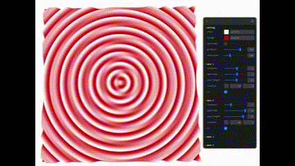

# Sine Wave inteference simulation (React three fiber)
This project allows you to simulate the interference patterns of up to four sine waves on the web browser.

Users can adjust location, amplitude, wavelength, and frequency of each waves.

## DEMO

## Installation
>git clone [this repository]
>cd [this repository]
>npm install
>npm run dev

## How did I make this?
I use React for the frontend and three.js(React Three Fiber) as the graphics library. The sine waves are just three.js plane geometry with custom shaders. Please note that the current code is not written for anyone to learn from. It is unfinished. I plan to rewrite it for better readability when I have more free time.

Instead of reading my code, just follow my guide below.

If you already know react three fiber, then you are ready to learn how to create a wave. This blog post will teach you all you need.
[wave-tutorial](https://blog.maximeheckel.com/posts/the-study-of-shaders-with-react-three-fiber/)

If you are not familiar with react or three.js or shading then
* **Learn React (optional)**: You don't have to use React; plain JavaScript is fine.
* **Learn Three.JS**: There are plenty of learning materials, but the best one is the [Three.js journey](https://threejs-journey.com/) by Bruno Simmon. React Three Fiber is optional; you can use vanilla Three.js.
* **Learn shaders**  : Even if you've never heard of shaders before, it won't take more than a few days to create a project like this. Visit [shadertoy](https://www.shadertoy.com/) to see what you can do with shaders. Bruno Simmon course mentioned above also teaches you how to write custom shaders for Three.js. Another excellent resource is [the book of shading](https://thebookofshaders.com/) (it's free and is the most recommended resource to learn from).

## TBD
* Currently, all waves are in phase. Once I have free time, I will add an option to start each wave with a different phase.
* Add other type of waves. 
* I intend to rewrite the code to make it easier to read.